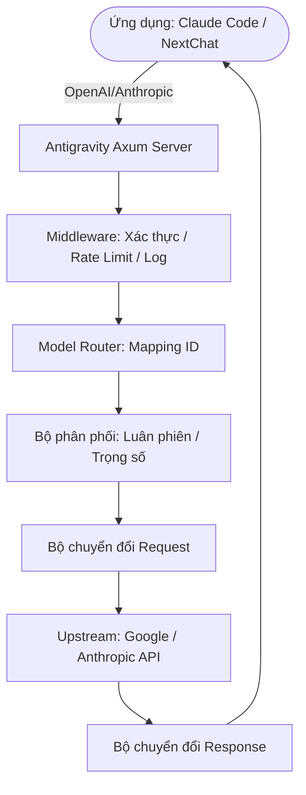

# Antigravity Tools 🚀 — Powered by [oshioxi.com](http://oshioxi.com/)
> Hệ thống quản lý tài khoản AI & API Proxy chuyên nghiệp (v4.1.29)

<div align="center">
  

  <h3>Cổng điều phối AI hiệu suất cao của bạn</h3>
  <p>Quản lý đa tài khoản, chuyển đổi giao thức & điều phối request thông minh — tất cả trong một ứng dụng desktop.</p>
  
  <p>
    
    
    
    
  </p>

  <p>
    <a href="#-tính-năng-chính">Tính năng</a> • 
    <a href="#-cài-đặt">Cài đặt</a> • 
    <a href="#-hướng-dẫn-nhanh">Hướng dẫn</a> • 
    <a href="#-dịch-vụ-oshioxi">Dịch vụ</a> • 
    <a href="#-hỗ-trợ">Hỗ trợ</a>
  </p>
</div>

---

## 🌐 Giới Thiệu Oshioxi

**[oshioxi.com](http://oshioxi.com/)** — Nền tảng cung cấp dịch vụ AI Premium hàng đầu Việt Nam.

| Dịch vụ | Mô tả | Link |
|---------|-------|------|
| 🤖 **ChatGPT Plus** | GPT-5.4, Codex 5.4, DALL-E 3, Browsing & Plugins | [Kích hoạt](http://oshioxi.com/chatgpt-plus) |
| 💎 **Gemini AI Pro** | Gemini Pro không giới hạn + Canvas + Guided Learning (5 slot) | [Kích hoạt](http://oshioxi.com/gemini-ai-pro) |
| 👑 **Gemini Ultra** | Gemini Ultra + Antigravity Ultra + CLI Claude + CLI Gemini + 30TB | [Kích hoạt](http://oshioxi.com/gemini-ultra) |
| 💼 **Chat Business** | ChatGPT Business Team (5 slot) + GPT-4, Codex, DALL-E | [Kích hoạt](http://oshioxi.com/chat-business) |
| 🎨 **Canva EDU** | Canva Pro đầy đủ + Template Premium + Xóa nền AI | [Kích hoạt](http://oshioxi.com/canva-edu) |
| 🎬 **Adobe 3 Tháng** | Photoshop, Illustrator, Premiere, Lightroom, After Effects | [Kích hoạt](http://oshioxi.com/adobe-3-thang) |
| 🔌 **API AI** | Cho thuê API AI — tích hợp vào ứng dụng của bạn | [Xem thêm](http://oshioxi.com/api-services) |

### Tại sao chọn Oshioxi?

- ⚡ **Kích hoạt tức thì** — Nhận tài khoản ngay sau khi nhập mã
- 🔐 **Bảo mật tuyệt đối** — Tài khoản riêng biệt, mã hóa dữ liệu
- 📞 **Hỗ trợ 24/7** — Zalo, Messenger, Hotline
- 💰 **Giá tốt nhất** — Chỉ bằng 1/3 so với đăng ký trực tiếp
- 🔄 **Gia hạn dễ dàng** — Mua mã mới → kích hoạt → xong
- 📖 **Hướng dẫn chi tiết** — Tài liệu + video tutorial đầy đủ

---

## 🌟 Tính Năng Chính

### 1. 🎛️ Bảng Điều Khiển Thông Minh
- **Giám sát thời gian thực** toàn bộ tài khoản (Gemini Pro, Flash, Claude, Imagen)
- **Gợi ý tài khoản tốt nhất** — thuật toán chọn account có quota dư nhiều nhất
- **Chuyển đổi 1 click** giữa các tài khoản

### 2. 🔐 Quản Lý Tài Khoản Chuyên Nghiệp
- **OAuth 2.0** — Tự động/thủ công, hỗ trợ copy link auth
- **Import hàng loạt** — JSON batch import, token đơn, di cư từ v1
- **Phát hiện 403** — Tự động đánh dấu & bỏ qua account bị cấm

### 3. 🔌 Chuyển Đổi Giao Thức & API Proxy
- **OpenAI**: `/v1/chat/completions` — tương thích 99% ứng dụng AI
- **Anthropic**: `/v1/messages` — hỗ trợ đầy đủ **Claude Code CLI**
- **Gemini**: Google SDK native format
- **Tự phục hồi thông minh**: 429/401 → tự động retry & xoay tài khoản

### 4. 🔀 Trung Tâm Điều Hướng Model
- **Mapping theo series** — gộp model vào nhóm, định tuyến thông minh
- **Regex redirect** — kiểm soát chính xác từng request
- **Phân tầng ưu tiên** — Ultra > Pro > Free, xoay theo tốc độ reset
- **Hạ cấp background** — request nền tự chuyển sang Flash model

### 5. 🎨 Hỗ Trợ Đa Phương Tiện & Imagen 3
- **Tạo ảnh AI** — hỗ trợ `size`, `quality`, `imageSize` qua mọi giao thức
- **Payload lớn** — hỗ trợ đến **100MB** cho nhận dạng ảnh 4K

---

## 📸 Giao Diện

| | |
| :---: | :---: |
|  <br> Bảng điều khiển |  <br> Danh sách tài khoản |
|  <br> Giới thiệu |  <br> API Proxy |

---

## 🏗️ Kiến Trúc



---

## 📥 Cài Đặt

### Cách 1: Cài tự động (Khuyến nghị)

**Windows (PowerShell):**
```powershell
irm https://raw.githubusercontent.com/lbjlaq/Antigravity-Manager/main/install.ps1 | iex
```

**macOS / Linux:**
```bash
curl -fsSL https://raw.githubusercontent.com/lbjlaq/Antigravity-Manager/v4.1.29/install.sh | bash
```

### Cách 2: Tải thủ công
- [GitHub Releases](https://github.com/lbjlaq/Antigravity-Manager/releases)
- **Windows**: `.msi` hoặc `.zip` | **macOS**: `.dmg` | **Linux**: `.deb` / `.AppImage`

### Cách 3: Docker (VPS / Server)
```bash
docker run -d --name antigravity-manager \
  -p 8045:8045 \
  -e API_KEY=sk-your-api-key \
  -e WEB_PASSWORD=your-password \
  -v ~/.antigravity_tools:/root/.antigravity_tools \
  lbjlaq/antigravity-manager:latest
```

> **Truy cập**: `http://localhost:8045` (Admin) | `http://localhost:8045/v1` (API Base)

> **macOS báo "App bị hỏng"?** Chạy: `sudo xattr -rd com.apple.quarantine "/Applications/Antigravity Tools.app"`

---

## ⚡ Hướng Dẫn Nhanh

### Thêm Tài Khoản Google (OAuth)
1. **Accounts** → **Thêm tài khoản** → **OAuth**
2. Copy link xác thực → mở trong trình duyệt → đăng nhập Google
3. Trình duyệt hiển thị **"✅ Đã xác thực thành công!"**
4. Quay lại app → tài khoản được lưu tự động

### Kết nối Claude Code CLI
```bash
# 1. Cài Claude CLI
npm install -g @anthropic-ai/claude-code

# 2. Cấu hình
export ANTHROPIC_API_KEY="sk-antigravity"
export ANTHROPIC_BASE_URL="http://127.0.0.1:8045"

# 3. Chạy
claude
```

**Windows PowerShell:**
```powershell
$env:ANTHROPIC_API_KEY = "sk-antigravity"
$env:ANTHROPIC_BASE_URL = "http://127.0.0.1:8045"
claude
```

### Kết nối Python SDK
```python
import openai

client = openai.OpenAI(
    api_key="sk-antigravity",
    base_url="http://127.0.0.1:8045/v1"
)

response = client.chat.completions.create(
    model="gemini-3-flash",
    messages=[{"role": "user", "content": "Xin chào!"}]
)
print(response.choices[0].message.content)
```

### Đồng bộ CLI khác
Vào Antigravity → tab **"Đồng bộ CLI"** → chọn card tương ứng → **"Đồng bộ ngay"**

Hỗ trợ: **Claude Code** | **Gemini CLI** | **Codex AI** | **OpenCode** | **Droid**

---

## 🛡️ Chống Phát Hiện (Anti-Detection)

> ⚠️ Google đang siết chặt phong toả từ tháng 03/2026.

### Các lớp bảo vệ đã tích hợp:
| Tính năng | Mô tả |
|-----------|-------|
| JA3 Fingerprint | Giả lập Chrome 123 (BoringSSL) |
| Dynamic User-Agent | Tự đọc version thật từ IDE |
| Full Header Injection | X-Client-Name, X-Machine-Id, v.v. |
| OAuth Clean Exchange | Request sạch khi đổi token |
| Smart Retry | 429/401 → tự xoay tài khoản |
| 403 Auto-Disable | Tự tắt account bị cấm |

### Khuyến nghị an toàn:
- Tắt **"Auto Refresh"** và **"Quota Protection"**
- Tối đa **3-5 account/IP**
- Dùng **residential proxy** nếu chạy nhiều account
- Xem chi tiết: [`anti-ban-research.md`](anti-ban-research.md)

---

## 📖 Tài Liệu Thêm

| File | Mô tả |
|------|-------|
| [`claude-cli-setup-guide.md`](claude-cli-setup-guide.md) | Hướng dẫn cài đặt đầy đủ (gửi khách) |
| [`claude-cli-quickstart.md`](claude-cli-quickstart.md) | Quick start 5 phút |
| [`anti-ban-research.md`](anti-ban-research.md) | Nghiên cứu chống Google ban |
| [`docs/API_REFERENCE.md`](docs/API_REFERENCE.md) | Tài liệu API |
| [`docs/gemini-3-image-guide.md`](docs/gemini-3-image-guide.md) | Hướng dẫn tạo ảnh Imagen 3 |

---

## 📞 Dịch Vụ Oshioxi

### 🛒 Mua dịch vụ
- **Website**: [oshioxi.com](http://oshioxi.com/)
- **Sản phẩm**: [oshioxi.com/pages/san-pham](http://oshioxi.com/pages/san-pham)
- **API AI**: [oshioxi.com/api-services](http://oshioxi.com/api-services)
- **API Docs**: [oshioxi.com/api-docs](http://oshioxi.com/api-docs)

### 🎓 Học tập
- **Vibe Coding**: [oshioxi.com/pages/vibe-coding](http://oshioxi.com/pages/vibe-coding)
- **Blog**: [oshioxi.com/pages/blog](http://oshioxi.com/pages/blog)

### 📞 Hỗ trợ
- **Telegram**: [t.me/oshioxi](https://t.me/oshioxi)
- **Hướng dẫn mua hàng**: [oshioxi.com/pages/huong-dan](http://oshioxi.com/pages/huong-dan)
- **FAQ**: [oshioxi.com/pages/faq](http://oshioxi.com/pages/faq)
- **Cộng đồng**: [oshioxi.com/pages/cong-dong](http://oshioxi.com/pages/cong-dong)

### 🤝 Đại lý
- **Đăng ký đại lý**: [oshioxi.com/pages/dang-ky-dai-ly.php](http://oshioxi.com/pages/dang-ky-dai-ly.php)
- **Tuyển CTV**: [oshioxi.com/pages/tuyen-dung](http://oshioxi.com/pages/tuyen-dung)

---

## 📝 Xử Lý Sự Cố

| Lỗi | Giải pháp |
|------|----------|
| `403 Forbidden` | Kiểm tra email — có thể cần verify Google. Chờ rồi thử lại. |
| `429 Too Many Requests` | Hệ thống tự xoay account. Nếu hết quota, chờ reset. |
| `400 INVALID_ARGUMENT` | Cập nhật Antigravity mới nhất. Kiểm tra model mapping. |
| `404 Not Found` | Kiểm tra project ID. Xoá & thêm lại tài khoản. |
| Bị ban | [Google Appeal](https://forms.gle/hGzM9MEUv2azZsrb9). Chuyển sang account switching. |

---

<div align="center">
  <p><strong>Powered by <a href="http://oshioxi.com/">oshioxi.com</a></strong> — Dịch vụ AI Premium #1 Việt Nam</p>
  <p>© 2024-2026 oshioxi.com | Dựa trên <a href="https://github.com/lbjlaq/Antigravity-Manager">Antigravity-Manager</a></p>
</div>
